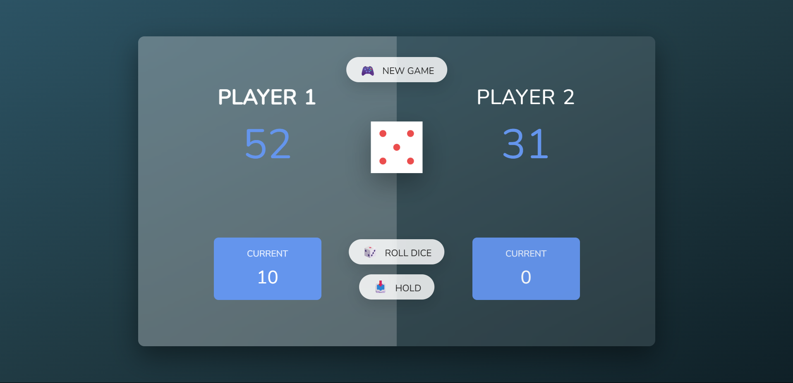

# ⚔️ Dice Duel – A Two-Player Dice Game

Welcome to **Dice Duel**, a fun and strategic two-player dice game built with **HTML, CSS, and JavaScript**!

Take turns, roll the dice, collect points — but beware! Rolling a **1** means you lose your turn. Hold wisely, and race to **100 points** before your opponent!

<br><br>



<br>

<h2>👉 <a href="https://rashadul-islam-code.github.io/Dice_Duel_Game/" target="_blank">Click here to play the game</a></h2>


<br>

## 🎮 How to Play

- Each player takes turns rolling a dice 🎲.
- Rolling any number except 1 adds it to your current turn score.
- Roll a 1? Your turn ends and you lose the turn's points.
- Choose **"Hold"** to add your current score to your total.
- First player to reach **100 points** wins! 🏆

---

## 🧠 Features

- 🎲 Realistic dice roll logic
- ✨ Clean glassmorphic design with blue or green themes
- 🎯 Dynamic score updates
- 🔄 “New Game” reset functionality
- 💻 Responsive layout for desktop screens

---

## 🔧 Technologies Used

- **HTML5**
- **CSS3 (Glassmorphism + Transitions)**
- **Vanilla JavaScript**
- *(Optional)* Emoji-enhanced UI elements 😎

---

## 📦 Folder Structure

```bash
/
├── index.html
├── style.css
├── script.js
├── dice-1.png to dice-6.png
└── assets/
    └── screenshot.png

